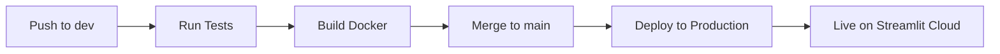

# Sales Data Analytics Application | Приложение анализа данных о продажах

**🌍 [Live Demo](https://example001.streamlit.app/) | 📊 Interactive Analytics | 🚀 Full DevOps Pipeline**

*Scroll down for [Russian version](#русская-версия) | Прокрутите вниз для [русской версии](#русская-версия)*

---

## 🎯 Project Overview

This project demonstrates a **complete data science and software development lifecycle**, from exploratory data analysis to production deployment. It showcases modern DevOps practices, automated testing, and cloud deployment using a sales data analytics use case.

### 🏢 Business Value

**For Business:**
- **📈 Data-Driven Decisions**: Transform raw sales data into actionable insights
- **⏱️ Real-Time Analytics**: Interactive dashboards for immediate business intelligence
- **🔍 Trend Analysis**: Identify sales patterns, peak periods, and product performance
- **📊 Automated Reporting**: Generate comprehensive sales reports with downloadable outputs
- **🎯 Product Strategy**: Compare product performance and optimize sales strategies

**For Development Teams:**
- **🛠️ Full DevOps Pipeline**: Complete CI/CD workflow with automated testing and deployment
- **🧪 Quality Assurance**: Comprehensive testing suite (unit, integration, code quality)
- **🐳 Containerization**: Docker-based deployment for consistency across environments
- **📋 Best Practices**: Modern Python development with proper project structure

## 🏗️ Technical Architecture

### 📱 Application Features
- **📤 File Upload**: Drag-and-drop Excel file processing
- **📊 Interactive Visualizations**: Time series plots, bar charts, correlation heatmaps
- **📈 Statistical Analysis**: Descriptive statistics, trend analysis, key performance indicators
- **📝 Report Generation**: Automated report creation with download functionality
- **🎨 Professional UI**: Clean, responsive Streamlit interface in Russian

### 🔧 Technology Stack
- **Frontend**: Streamlit (Python web framework)
- **Data Processing**: Pandas, NumPy
- **Visualization**: Matplotlib, Seaborn
- **Testing**: Pytest (55+ comprehensive tests)
- **Containerization**: Docker
- **CI/CD**: GitHub Actions
- **Deployment**: Streamlit Cloud, Docker Hub

## 🚀 Development Workflow

### 🌿 Git Branch Strategy
```
main    ←  Production-ready code, triggers auto-deployment
 ↑
dev     ←  Development branch, all feature work happens here
```

**Development Process:**
1. **Work in `dev` branch**: All development, features, and fixes
2. **Automated Testing**: Push to `dev` triggers comprehensive test suite
3. **Production Deployment**: Merge `dev` → `main` triggers auto-deployment to Docker Hub
4. **Live Application**: Changes automatically deployed to [Streamlit Cloud](https://example001.streamlit.app/)

### 🔄 CI/CD Pipeline


**Automated Pipeline:**
- ✅ **Code Quality**: Flake8 linting and formatting checks
- ✅ **Testing**: 55+ tests covering unit, integration, and code quality
- ✅ **Docker Build**: Multi-platform container images (AMD64/ARM64)
- ✅ **Security Scanning**: Automated vulnerability detection
- ✅ **Production Deploy**: Automatic deployment to Docker Hub and Streamlit Cloud

## 🧪 Testing Strategy

**Comprehensive Test Suite (55+ tests):**
- **Unit Tests**: Individual function testing with various data scenarios
- **Integration Tests**: Full application workflow testing
- **Code Quality**: Syntax validation, structure analysis, security checks
- **Performance Tests**: Memory usage and execution time monitoring
- **Data Validation**: Edge cases, error handling, data type consistency

**Test Coverage:**
```bash
# Run all tests
python -m pytest tests/ -v

# Run with coverage
python -m pytest tests/ --cov=streamlit_app --cov-report=term-missing

# Run specific test categories
python -m pytest tests/ -m "unit"        # Unit tests only
python -m pytest tests/ -m "integration" # Integration tests only
```

## 🐳 Docker Deployment

**Self-Contained Application:**
```bash
# Pull and run from Docker Hub
docker pull USERNAME/sales-analytics-app:latest
docker run -p 8501:8501 USERNAME/sales-analytics-app:latest
```

**Local Development:**
```bash
# Clone repository
git clone https://github.com/mihnin/example1.git
cd example1

# Setup virtual environment
python -m venv venv
.\venv\Scripts\activate  # Windows
source venv/bin/activate # Linux/Mac

# Install dependencies
pip install -r requirements.txt

# Run application
streamlit run streamlit_app.py
```

## 📊 Sample Data Structure

The application processes Excel files with the following structure:
```
| Date       | Product_1 | Product_2 | Product_3 |
|------------|-----------|-----------|-----------|
| 2020-01-01 | 1000      | 1500      | 800       |
| 2020-02-01 | 1100      | 1400      | 850       |
| ...        | ...       | ...       | ...       |
```

## 🎓 Educational Purpose

This project serves as a **comprehensive learning example** demonstrating:

1. **Data Science Workflow**: From Jupyter notebooks to production applications
2. **Modern DevOps**: Git workflow, automated testing, CI/CD pipelines
3. **Cloud Deployment**: Container orchestration and cloud hosting
4. **Quality Assurance**: Testing strategies and code quality maintenance
5. **Project Management**: Issue tracking, documentation, and collaboration

**Perfect for:**
- Data Science students learning production deployment
- Developers exploring DevOps best practices
- Teams adopting modern development workflows
- Businesses understanding data analytics implementation

---

## Русская версия 4534534543534

## 🎯 Обзор проекта

Этот проект демонстрирует **полный жизненный цикл разработки приложений для анализа данных**, от исследовательского анализа до продуктивного развертывания. Проект показывает современные DevOps практики, автоматизированное тестирование и облачное развертывание на примере анализа данных о продажах.

### 🏢 Бизнес-ценность

**Для бизнеса:**
- **📈 Принятие решений на основе данных**: Превращение сырых данных о продажах в практические инсайты
- **⏱️ Аналитика в реальном времени**: Интерактивные дашборды для мгновенной бизнес-аналитики
- **🔍 Анализ трендов**: Выявление паттернов продаж, пиковых периодов и производительности продуктов
- **📊 Автоматизированная отчетность**: Генерация комплексных отчетов о продажах с возможностью скачивания
- **🎯 Стратегия продуктов**: Сравнение производительности продуктов и оптимизация стратегий продаж

**Для команд разработки:**
- **🛠️ Полный DevOps пайплайн**: Комплексный CI/CD workflow с автоматизированным тестированием и развертыванием
- **🧪 Обеспечение качества**: Комплексный набор тестов (модульные, интеграционные, качества кода)
- **🐳 Контейнеризация**: Docker-развертывание для консистентности между окружениями
- **📋 Лучшие практики**: Современная разработка на Python с правильной структурой проекта

## 🏗️ Техническая архитектура

### 📱 Возможности приложения
- **📤 Загрузка файлов**: Обработка Excel файлов методом drag-and-drop
- **📊 Интерактивные визуализации**: Временные ряды, столбчатые диаграммы, корреляционные тепловые карты
- **📈 Статистический анализ**: Описательная статистика, анализ трендов, ключевые показатели эффективности
- **📝 Генерация отчетов**: Автоматическое создание отчетов с возможностью скачивания
- **🎨 Профессиональный UI**: Чистый, отзывчивый интерфейс Streamlit на русском языке

### 🔧 Технологический стек
- **Frontend**: Streamlit (Python веб-фреймворк)
- **Обработка данных**: Pandas, NumPy
- **Визуализация**: Matplotlib, Seaborn
- **Тестирование**: Pytest (55+ комплексных тестов)
- **Контейнеризация**: Docker
- **CI/CD**: GitHub Actions
- **Развертывание**: Streamlit Cloud, Docker Hub

## 🚀 Рабочий процесс разработки

### 🌿 Стратегия Git веток
```
main    ←  Готовый к продакшену код, запускает автоматическое развертывание
 ↑
dev     ←  Ветка разработки, вся работа над функциями происходит здесь
```

**Процесс разработки:**
1. **Работа в ветке `dev`**: Вся разработка, функции и исправления
2. **Автоматизированное тестирование**: Push в `dev` запускает комплексный набор тестов
3. **Продуктивное развертывание**: Merge `dev` → `main` запускает автоматическое развертывание в Docker Hub
4. **Живое приложение**: Изменения автоматически развертываются в [Streamlit Cloud](https://example001.streamlit.app/)

### 🔄 CI/CD пайплайн

**Автоматизированный пайплайн:**
- ✅ **Качество кода**: Проверки линтинга и форматирования Flake8
- ✅ **Тестирование**: 55+ тестов, покрывающих модульное, интеграционное тестирование и качество кода
- ✅ **Docker сборка**: Мультиплатформенные образы контейнеров (AMD64/ARM64)
- ✅ **Сканирование безопасности**: Автоматическое обнаружение уязвимостей
- ✅ **Продуктивное развертывание**: Автоматическое развертывание в Docker Hub и Streamlit Cloud

## 🧪 Стратегия тестирования

**Комплексный набор тестов (55+ тестов):**
- **Модульные тесты**: Тестирование отдельных функций с различными сценариями данных
- **Интеграционные тесты**: Тестирование полного рабочего процесса приложения
- **Качество кода**: Валидация синтаксиса, анализ структуры, проверки безопасности
- **Тесты производительности**: Мониторинг использования памяти и времени выполнения
- **Валидация данных**: Граничные случаи, обработка ошибок, консистентность типов данных

## 🐳 Docker развертывание

**Самодостаточное приложение:**
```bash
# Скачать и запустить из Docker Hub
docker pull USERNAME/sales-analytics-app:latest
docker run -p 8501:8501 USERNAME/sales-analytics-app:latest
```

**Локальная разработка:**
```bash
# Клонировать репозиторий
git clone https://github.com/mihnin/example1.git
cd example1

# Настроить виртуальное окружение
python -m venv venv
.\venv\Scripts\activate  # Windows
source venv/bin/activate # Linux/Mac

# Установить зависимости
pip install -r requirements.txt

# Запустить приложение
streamlit run streamlit_app.py
```

## 🎓 Образовательная цель

Этот проект служит **комплексным учебным примером**, демонстрирующим:

1. **Рабочий процесс Data Science**: От Jupyter блокнотов до продуктивных приложений
2. **Современный DevOps**: Git workflow, автоматизированное тестирование, CI/CD пайплайны
3. **Облачное развертывание**: Оркестрация контейнеров и облачный хостинг
4. **Обеспечение качества**: Стратегии тестирования и поддержание качества кода
5. **Управление проектами**: Отслеживание задач, документация и сотрудничество

**Идеально подходит для:**
- Студентов Data Science, изучающих продуктивное развертывание
- Разработчиков, исследующих лучшие DevOps практики
- Команд, принимающих современные рабочие процессы разработки
- Бизнеса, понимающего реализацию аналитики данных

---

## 📞 Contact | Контакты

- **Live Application**: https://example001.streamlit.app/
- **GitHub Repository**: https://github.com/mihnin/example1
- **Docker Hub**: Automated builds available

---

*This project demonstrates the complete journey from data analysis to production deployment, showcasing modern software development practices in the data science domain.*

*Этот проект демонстрирует полный путь от анализа данных до продуктивного развертывания, демонстрируя современные практики разработки программного обеспечения в области data science.*